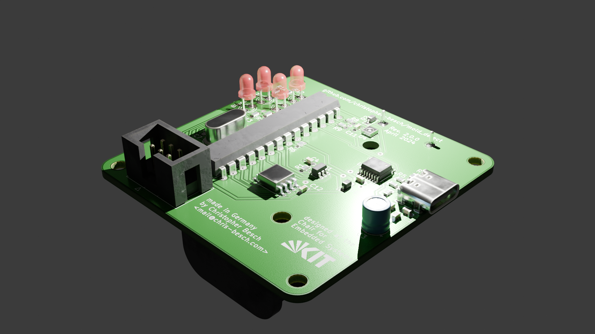

# mold_detect

Warn residents of mold-friendly atmosphere and log opened windows.

This project is being developed in AVR_C on an Atmega328p.
It provides:
- Temperature, Humidity Logging (every minute with flash storage for two years)
- Serial terminal via USB-C
- ~5uA power consumption at 3V battery power

The PCB is designed in KiCad and manufactured by Aisler.

# Parts
- [TPL5010](https://www.digikey.de/de/products/detail/texas-instruments/TPL5010DDCR/5119105)
- [2 AAA Battery pack](https://www.digikey.de/de/products/detail/keystone-electronics/2468/303817)
- [SHT30](https://www.digikey.de/de/products/detail/sensirion-ag/SHT30-DIS-B2-5KS/5872250)
- [W25Q128JVSIQ](https://www.digikey.de/de/products/detail/winbond-electronics/W25Q128JVSIQ-TR/5803944)
- [FT230XS](https://www.digikey.de/en/products/detail/ftdi-future-technology-devices-international-ltd/FT230XS-R/3029141)
- [USB4105](https://www.digikey.de/en/products/detail/gct/USB4105-GF-A/11198441)
